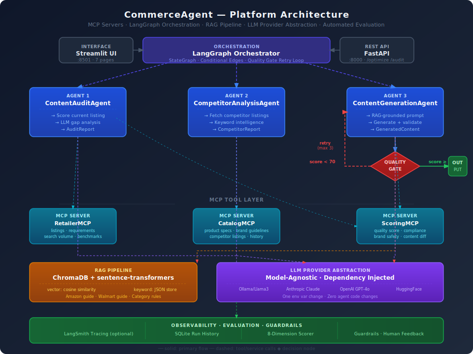

# CommerceAgent

**Agentic AI platform for e-commerce content optimization at scale.**

[](https://python.org)
[](https://langchain-ai.github.io/langgraph/)
[](https://fastapi.tiangolo.com)
[](https://www.trychroma.com)
[](LICENSE)

---

> *"Not a demo. A platform."*
>
> CommerceAgent demonstrates VP/Director-level AI platform architecture thinking —
> MCP-powered tool layer, LangGraph multi-agent orchestration, RAG-grounded generation,
> automated evaluation, and full observability — applied to a real problem that
> Fortune 100 CPG brands face every day.

---

## The Problem This Solves

CPG brands and e-commerce sellers managing hundreds of SKUs face a persistent content quality problem that costs them search rank and revenue:

- Product listings on **Amazon and Walmart degrade over time** — titles get truncated, bullet points go stale, keyword rankings drop
- **Manual content auditing at scale is expensive and inconsistent** — a 500-SKU audit takes weeks and is already outdated by delivery
- **Generic AI tools hallucinate compliance** — they produce fluent content that violates retailer-specific character limits, contains prohibited words, or invents product specifications
- **No feedback loop** connects content quality decisions to actual competitive signals or sales performance

CommerceAgent solves all four problems in a single automated pipeline that runs in under 60 seconds per SKU.

---

## Architecture Overview



> See [`docs/architecture.svg`](docs/architecture.svg) for the full interactive diagram.
> The **Architecture** page inside the Streamlit app includes a live version with ADR explanations.

The platform is built on five layers that compose into a complete production system:

| Layer | Technology | Role |
|---|---|---|
| **Orchestration** | LangGraph `StateGraph` | Multi-agent workflow with conditional retry loop |
| **Tool Boundary** | MCP Servers (3) | Versioned, decoupled data and scoring APIs |
| **Generation** | LLM Provider Abstraction | Model-agnostic: Claude, Llama3, GPT-4o, HuggingFace |
| **Grounding** | ChromaDB + sentence-transformers | RAG over retailer style guides and category rules |
| **Evaluation** | Custom scoring framework | 8-dimension automated quality gate on every output |

---

## Key Capabilities

### Multi-Agent Pipeline (LangGraph)

Three specialized agents coordinate through a stateful LangGraph graph:

**ContentAuditAgent** analyzes the current listing against retailer-specific requirements fetched via MCP. It scores across five dimensions (title compliance, keyword inclusion, bullet quality, readability, specificity), runs retailer compliance validation, and uses the configured LLM to produce a prioritized gap analysis that goes beyond rule-based checks.

**CompetitorAnalysisAgent** fetches top-ranked competitor listings, extracts keyword candidates, enriches them with search volume data, and uses the LLM to identify winning content patterns and content gaps — the specific things competitors include that the current listing doesn't.

**ContentGenerationAgent** combines the audit findings, competitor intelligence, authoritative product specs, and real-time RAG-retrieved retailer rules into a single grounded generation prompt. It produces a complete listing rewrite — title, five bullet points, full description, and backend keywords — then scores and validates the output before returning it.

### Quality Gate Loop

If generated content scores below the configurable threshold (default: 70/100), LangGraph routes back to ContentGenerationAgent with specific per-dimension improvement instructions. This self-correcting loop eliminates the human review step for routine optimization runs. Maximum retries are configurable to prevent infinite loops on edge cases.

### MCP Tool Layer

Three MCP servers expose tools to agents through a clean service boundary:

- **RetailerMCP** — listing data, retailer-specific requirements, search volume, category benchmarks
- **CatalogMCP** — authoritative product specs, brand guidelines, competitor listings, content history
- **ScoringMCP** — 8-dimension content scoring, retailer compliance validation, brand safety detection, content diff

### RAG Pipeline (Dual-Mode)

Retailer guidelines are retrieved at generation time rather than hardcoded, eliminating compliance drift when Amazon or Walmart updates their style guides.

| Mode | Configuration | Use Case |
|---|---|---|
| `RAG_MODE=vector` | sentence-transformers + ChromaDB cosine similarity | Production — finds semantically related rules |
| `RAG_MODE=keyword` | Plain JSON + keyword overlap scoring | Development — no model download, instant startup |

Both modes use the same `RAGRetriever` interface. Agents never know which mode is active.

### Model-Agnostic LLM Layer

Every agent receives its LLM via dependency injection against an abstract `LLMProvider` interface. Switching providers requires one environment variable change — zero agent code changes.

| Provider | Config | Notes |
|---|---|---|
| Ollama / Llama3 | `LLM_PROVIDER=ollama` | Default — local, no API key, no cost |
| Anthropic Claude | `LLM_PROVIDER=anthropic` | Best reasoning quality |
| OpenAI GPT-4o | `LLM_PROVIDER=openai` | Optional |
| HuggingFace Local | `LLM_PROVIDER=huggingface_local` | On-premise deployment |
| HuggingFace API | `LLM_PROVIDER=huggingface_api` | Serverless inference |

### Automated Evaluation Framework

Every output is scored across 8 dimensions before it reaches the user:

| Metric | Measurement | Target |
|---|---|---|
| Title Compliance | Character count vs. retailer limit | 100% |
| Keyword Inclusion | Top-5 search-volume keywords present | ≥ 80% |
| Bullet Count | Exactly N bullets per retailer spec | 100% |
| Bullet Length | Each bullet within character limit | 100% |
| Readability | Flesch-Kincaid score | 60–80 |
| Brand Safety | Prohibited term detection | 0 flags |
| Specificity | Concrete claims vs. vague language ratio | ≥ 70% |
| Improvement Delta | New score vs. baseline | > 0 |

Human feedback (thumbs up/down + comment) is stored in SQLite and structured for future fine-tuning workflows.

### Guardrails

Three guardrail layers run on every generated output:

- **Hallucination detection** — numeric claims in generated content are verified against authoritative product specs. A generated bullet claiming "40-hour battery" when specs say "30 hours" is flagged before delivery.
- **Brand safety** — prohibited claim detection covers medical claims, false regulatory claims, and brand-specific language rules.
- **PII detection** — ensures no email addresses, phone numbers, or similar data appear in product content.

### Observability

Every pipeline run is traced to LangSmith (when configured) and always persisted to local SQLite:

- Run ID, timestamp, SKU, retailer
- Provider and model
- Score before and after, improvement delta
- Token usage, estimated cost, latency
- Quality gate result and retry count
- Guardrail trigger events

---

## Quickstart

```bash
git clone https://github.com/saralabiswal/commerce-agent
cd commerce-agent
python3 -m venv .venv
source .venv/bin/activate
cp .env.example .env
make setup
```

Open two terminals:

```bash
# Terminal 1
make run-api      # FastAPI on http://localhost:8000

# Terminal 2
make run-ui       # Streamlit on http://localhost:8501
```

**Default configuration runs fully local — no API keys required.**
The default provider is Ollama with Llama3. Install Ollama from [ollama.ai](https://ollama.ai) and run `ollama pull llama3` before `make setup`.

---

## LLM Provider Configuration

```bash
# Local (default — no API key)
LLM_PROVIDER=ollama
OLLAMA_MODEL=llama3

# Anthropic Claude (best results)
LLM_PROVIDER=anthropic
ANTHROPIC_API_KEY=sk-ant-...
ANTHROPIC_MODEL=claude-sonnet-4-20250514

# OpenAI
LLM_PROVIDER=openai
OPENAI_API_KEY=sk-...
OPENAI_MODEL=gpt-4o

# HuggingFace (local weights)
LLM_PROVIDER=huggingface_local
HF_MODEL=microsoft/Phi-3-mini-4k-instruct
```

One config change. Zero code changes. That is the point of the provider abstraction.

---

## RAG Configuration

```bash
# Full semantic search (production)
RAG_MODE=vector
EMBEDDING_MODEL=sentence-transformers/all-MiniLM-L6-v2
CHROMA_PERSIST_DIR=./data/chroma_db
RAG_TOP_K=5

# Keyword matching (development, no model download)
RAG_MODE=keyword
```

After changing `RAG_MODE`, rebuild the index:

```bash
make ingest-rag
```

---

## API Reference

Interactive docs at `http://localhost:8000/docs`.

Python technical documentation source: [`docs/source/index.rst`](docs/source/index.rst).
Generate the HTML locally with `make docs`, then open `docs/build/html/index.html`.

```
POST /optimize      {sku, retailer}            Full pipeline: audit → compete → generate → gate
POST /audit         {sku, retailer}            Audit and gap analysis only
GET  /runs          ?limit=20                  Run history with scores, latency, cost
GET  /runs/{id}                                Single run detail
GET  /metrics                                  Aggregate quality, cost, pass rate metrics
POST /feedback      {run_id, sku, rating}      Human feedback (thumbs up/down)
GET  /health                                   Provider connectivity and system status
```

```bash
curl -X POST http://localhost:8000/optimize \
  -H "Content-Type: application/json" \
  -d '{"sku": "ANKER-Q30-BLK", "retailer": "amazon"}'
```

---

## Streamlit Application

| Page | What It Does |
|---|---|
| **About** | Business overview — the problem, the solution, persona fit, and demo guidance |
| **Optimize** | Full pipeline with before/after score cards, keyword table, compliance badges |
| **Audit Only** | Gap analysis and priority improvements without generating new content |
| **Run History** | All runs with score movement, latency, cost, provider, retry count |
| **Metrics** | Aggregate quality, improvement delta, cost, quality gate pass rate, feedback |
| **Settings** | Live config, provider health check, RAG status, re-ingestion |
| **Architecture** | Agent workflow, architecture diagram, ADRs, tech stack, current config |

---

## Demo Products

Three realistic product examples are pre-loaded:

| SKU | Product | Category |
|---|---|---|
| `ANKER-Q30-BLK` | Soundcore by Anker Life Q30 Hybrid ANC Headphones | Electronics |
| `ECHO-DOT-5G-BLK` | Echo Dot 5th Gen Smart Speaker with Alexa | Smart Home |
| `TIDE-POD-96CT` | Tide PODS Spring Meadow Laundry Detergent, 96 Count | Grocery |

All three products include current listing data, competitor benchmarks, and authoritative product specs. The pipeline will audit, benchmark, and rewrite any of them end-to-end.

---

## Repository Structure

```
commerce-agent/
├── agents/
│   ├── content_audit_agent.py       # Scores current listing, runs LLM gap analysis
│   ├── competitor_analysis_agent.py # Extracts patterns from competitor listings
│   ├── content_generation_agent.py  # RAG-grounded generation with quality validation
│   ├── orchestrator.py              # LangGraph StateGraph, quality gate loop
│   └── models.py                    # AuditReport, CompetitorReport, GeneratedContent
├── llm/
│   ├── base.py                      # LLMProvider abstract interface
│   ├── anthropic_provider.py
│   ├── ollama_provider.py
│   ├── huggingface_provider.py
│   ├── openai_provider.py
│   └── factory.py                   # get_llm_provider() — reads from .env
├── mcp_servers/
│   ├── retailer_mcp_server.py       # Listing data, requirements, search volume
│   ├── catalog_mcp_server.py        # Product specs, brand guidelines, competitors
│   ├── scoring_mcp_server.py        # Quality scoring, compliance, brand safety
│   └── mock_data/                   # Realistic Amazon and Walmart mock data
├── rag/
│   ├── ingestion.py                 # Document chunking, embedding, ChromaDB ingest
│   ├── retrieval.py                 # Unified retrieve() interface (keyword + vector)
│   ├── embeddings.py                # sentence-transformers wrapper
│   └── documents/                   # Amazon style guide, Walmart guide, category rules
├── evaluation/
│   ├── content_scorer.py            # 8-dimension scoring with per-metric breakdown
│   └── human_feedback.py            # Thumbs up/down feedback store (SQLite)
├── observability/
│   ├── tracing.py                   # LangSmith + SQLite dual-sink tracer
│   ├── guardrails.py                # Hallucination, brand safety, PII detection
│   └── cost_tracker.py              # Token cost estimation per provider/model
├── api/
│   ├── main.py                      # FastAPI app with lifespan hooks
│   ├── schemas.py                   # Pydantic request/response models
│   └── routes/                      # optimize, audit, metrics route handlers
├── ui/
│   └── app.py                       # Streamlit dashboard (7 pages)
├── scripts/
│   └── init_db.py                   # SQLite schema initialization
├── tests/                           # pytest suite with mock LLM provider
├── config.py                        # Pydantic settings, single source of config
├── Makefile                         # setup, run, test, ingest-rag, clean
├── pyproject.toml
└── .env.example                     # All config options documented
```

---

## Key Architectural Decisions

These are the decisions that separate a production system from a demo. Each one is documented in the in-app Architecture page.

**ADR-001 — MCP over direct function calls**
Tools are implemented as MCP servers rather than direct Python imports. This creates a clean versioned service boundary — agents are decoupled from tool implementations and tool logic can change without touching agent code. The pattern matches how production systems like CommerceIQ implement agentic tool access.

**ADR-002 — LangGraph over LangChain chains**
The quality gate loop, conditional retry logic, and parallel-ready agent structure require a graph, not a chain. LangGraph makes state explicit via a typed `StateGraph` and transitions debuggable. Linear chains break silently on non-linear workflows.

**ADR-003 — RAG for retailer guidelines with dual-mode retrieval**
Retailer guidelines change. Amazon updates their style guides quarterly. Hardcoded rules create compliance drift. RAG ensures every generation is grounded in the current version of the rules. Two retrieval modes — vector (production) and keyword (development) — share the same interface so agents are unaffected by the switch.

**ADR-004 — Model-agnostic provider abstraction**
Every agent receives its LLM via dependency injection against an abstract interface. Provider-specific code is isolated behind concrete implementations. The same pipeline runs on Claude, Llama3, GPT-4o, or any HuggingFace model with one environment variable change.

**ADR-005 — Quality gate loop**
Generated content that doesn't meet the quality threshold is not returned — it is retried with targeted improvement instructions derived from the specific dimensions that failed. This creates a self-correcting loop rather than requiring human review of every output. The retry cap prevents infinite loops.

---

## Make Commands

```bash
make setup           # Install deps, copy .env, init DB, ingest RAG docs
make run-api         # FastAPI server on :8000
make run-ui          # Streamlit dashboard on :8501
make ingest-rag      # Rebuild RAG index (run after adding docs or changing RAG_MODE)
make clean-chroma    # Delete ChromaDB and re-ingest
make clean-db        # Reset SQLite run history
make test            # Full test suite with coverage
make test-agents     # Agent tests only
make test-mcp        # MCP server tests only
make test-eval       # Evaluation framework tests only
make docs            # Generate Python API docs in docs/build/html
make demo            # Run pipeline against ANKER-Q30-BLK from the command line
```

---

## Running Tests

```bash
make test
```

The test suite uses a mock LLM provider — no API keys required to run tests.

```bash
# Individual suites
make test-agents
make test-mcp
make test-eval
make test-providers

# Orchestrator, RAG, and observability
python -m pytest tests/test_orchestrator.py tests/test_rag.py tests/test_observability.py -v
```

---

## Observability Setup

Local SQLite observability works out of the box — no configuration needed.

LangSmith tracing is optional. To enable it:

```bash
LANGCHAIN_TRACING_V2=true
LANGCHAIN_API_KEY=ls__...
LANGCHAIN_PROJECT=commerce-agent
```

To disable (avoids 403 errors when no key is configured):

```bash
LANGCHAIN_TRACING_V2=false
```

---

## Roadmap — V2

The V1 architecture is designed to support these extensions without structural changes:

- **Live retailer API integration** — Amazon SP-API and Walmart Marketplace API for real listing data instead of mock data
- **Portfolio-scale auditing** — scheduled batch audits across hundreds of SKUs with delta reporting
- **Media Agent** — A+ content briefs, image prompt generation, and brand asset recommendations
- **Sales signal integration** — correlate content quality scores with BSR movement and conversion rate data
- **Retail media recommendations** — keyword bid suggestions derived from identified content gaps
- **Workflow approvals** — role-based approval gates for generated content before it publishes

---

## Skills and Technologies Demonstrated

This project demonstrates the following skills relevant to AI/ML engineering and technical leadership roles:

**Agentic AI Architecture** — multi-agent orchestration, stateful workflows, conditional retry loops, agent-tool decoupling via MCP

**LLM Engineering** — prompt engineering, RAG pipeline design, hallucination guardrails, model-agnostic abstraction, provider cost estimation

**ML Evaluation** — automated output scoring, multi-dimensional quality metrics, human feedback collection, evaluation-first development

**Backend Engineering** — FastAPI async REST API, Pydantic validation, SQLite via aiosqlite, LangSmith observability integration

**Software Architecture** — dependency injection, abstract interfaces, factory pattern, configuration-driven design, separation of concerns

**Python** — async/await, dataclasses, type hints, pytest, Pydantic v2, structured logging

**DevOps** — Makefile-driven workflow, venv management, environment-based configuration, test isolation with mock providers

---

## Author

**Sarala Biswal**
AI Platform Engineering · E-Commerce · Agentic Systems

[GitHub](https://github.com/saralabiswal) · [LinkedIn](https://linkedin.com/in/saralabiswal)

---

*CommerceAgent is an open-source portfolio project. It uses realistic mock data rather than live retailer APIs. It is not a SaaS product and is not monetized.*
